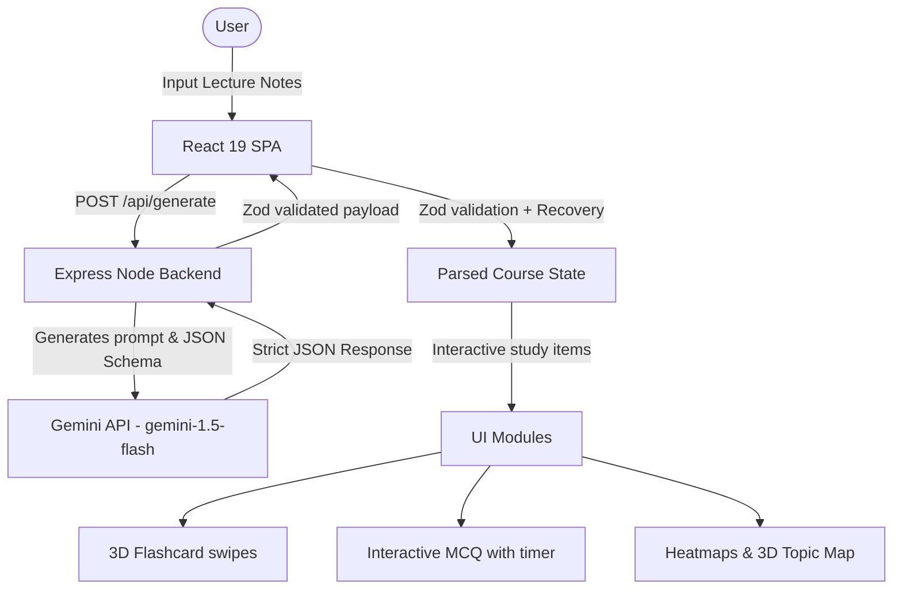

# Aether Study — AI Learning Workspace

Aether Study is a production-grade AI-powered study companion. It transforms unstructured learning materials (lecture notes, textbook uploads, complex coding models) into structured course guides featuring 3D interactive flashcards, MCQ quizzes, gamified achievements, XP systems, and Pomodoro focus blocks.

Designed with a premium dark-mode glassmorphic interface inspired by Vercel, Linear, and OpenAI, Aether Study utilizes a custom high-performance WebGL pipeline (Three.js) for landing page visual features, cursor tracking, and 3D coordinate-projected topic networks.

---

## Architecture Overview



Aether Study uses a **monorepo-inspired workspace layout**:
- **Frontend**: A React 19 application built on Vite, Tailwind CSS, and Framer Motion. Uses HTML5 Canvas 2D and vanilla WebGL/Three.js render bindings to guarantee maximum performance and React 19 compatibility.
- **Backend**: An Express.js microservice structured to interface with Google's Gemini API, providing helmet protections, rate limiting, and inputs validations.

---

## Folder Structure

```
├── backend/                  # Express.js Server Environment
│   ├── config/               # Configurations loaders
│   ├── controllers/          # Generative AI controllers (Gemini integrations)
│   ├── routes/               # API route maps
│   ├── middleware/           # Rate limiting and security middleware
│   ├── server.js             # Server entrypoint
│   ├── package.json          # Backend dependencies
│   └── .env.example          # Environment variables template
├── src/                      # React 19 Frontend Environment
│   ├── assets/               # Local static images
│   ├── components/           # Modular components
│   │   ├── analytics/        # Performance logs & Heatmap components
│   │   ├── dashboard/        # Saved sessions list components
│   │   ├── flashcards/       # Swiper & 3D Flashcard interfaces
│   │   ├── quiz/             # MCQ Quiz layouts
│   │   ├── layout/           # Sidebar, Navbar, Command Palette layouts
│   │   └── ui/               # Pomodoro, general buttons, 3D elements
│   ├── context/              # Context API (XP, Streaks, Pomodoro, Sessions)
│   ├── hooks/                # Keyboard listeners, focus checks hooks
│   ├── pages/                # Landing, Dashboard, Session details views
│   ├── services/             # Axios request models
│   ├── utils/                # JSON Repair utilities
│   ├── validators/           # Zod schema checks
│   ├── App.jsx               # Routes definitions
│   ├── main.jsx              # Main React bootstrap
│   └── index.css             # Main stylesheet (custom scrollbar, 3D card flips)
├── tailwind.config.js        # Theme extensions (gradients, custom curves)
├── postcss.config.js         # CSS compiler plugins
├── vite.config.js            # Vite configurations (port proxies)
└── package.json              # Workspace script entries
```

---

## Features Showcase

1. **3D Hero Reactor**: A floating glowing knowledge sphere wrapped in a neural wireframe shell, utilizing native WebGL, custom point lights, and parallax cursor tracking.
2. **Constellation Background**: Drifting stars that dynamically link to nearby points and gravitate toward the user's mouse position using lightweight, battery-saving canvas updates.
3. **Zod JSON Recovery Pipeline**: Zod parses all LLM responses on the frontend. If a response is malformed, our `jsonRepair` balancer attempts to clean trailing commas and close missing brackets. If keys are missing, our schema-recovery generator inserts default prompts rather than crashing the UI.
4. **Tinder-Style Swipes**: Flashcards can be flipped via `Space` or clicked. Dragging cards left bookmarks them for review later; dragging cards right registers concept mastery, rewarding XP.
5. **MCQ Quiz Engine**: Interactive quizzing complete with a 30-second ticking progress bar, correct/incorrect choice indicators, question explanations, and the ability to re-attempt *only* incorrect questions.
6. **Consistency Heatmap**: A contributions grid reflecting study frequency over the last 12 weeks, tracking active revision trends.
7. **Global Command Palette**: Activated via `Ctrl+K` (or `Cmd+K`), letting students search saved study guides, toggle Pomodoro controls, and navigate between views entirely via keyboard shortcuts.
8. **Gamified XP System**: Master cards, take quizzes, complete Pomodoro intervals, and study consistently to gain XP, level up, and unlock achievements.

---

## Installation & Running Locally

### Prerequisites
- Node.js (v18 or higher)
- npm (v9 or higher)
- MongoDB (local or Atlas)

### Setup Instructions

1. **Clone the project & navigate to the workspace**:
   ```bash
   cd "Study Assisstant"
   ```

2. **Install frontend and root dependencies**:
   ```bash
   npm install --legacy-peer-deps
   ```

3. **Install backend dependencies**:
   ```bash
   npm install --prefix backend
   ```

4. **Configure your environment variables**:
   - Create a copy of `backend/.env.example` named `backend/.env`.
   - Add your credentials:
     ```env
     PORT=5000
     GEMINI_API_KEY=YOUR_GEMINI_API_KEY
     JWT_SECRET=YOUR_SECURE_JWT_SECRET
     MONGODB_URI=YOUR_MONGODB_ATLAS_URI_OR_LOCAL_FALLBACK
     ```
   - *Note: Get a free Gemini API key from [Google AI Studio](https://aistudio.google.com/).*

5. **Start the workspace**:
   - Run both the React frontend and Node backend concurrently with:
     ```bash
     npm run dev
     ```
   - The React app runs on [http://localhost:3000](http://localhost:3000).
   - The Express backend runs on [http://localhost:5000](http://localhost:5000).

6. **Verify AI Connection**:
   - The backend terminal logs will check and output:
     `✓ MONGODB_URI Configured` (and database connection status)
     `✓ Gemini Configured` (confirming key was loaded successfully)
     `✓ JWT Ready`

---

## Environment Variables

| Variable | Description | Default | Required |
|---|---|---|---|
| `PORT` | The port the Express backend server listens on. | `5000` | No |
| `GEMINI_API_KEY` | Google Gemini access credentials for AI synthesis. | - | **Yes** (to enable generation) |
| `JWT_SECRET` | Secret token used to sign JWT authentication sessions. | `demo_secret_token_123` | **Yes** (for login protection) |
| `MONGODB_URI` | Connection URI to MongoDB Atlas or local MongoDB database. | `mongodb://localhost:27017/study-assistant` | **Yes** (for persistent storage) |

---

## Deployment Guidelines

### Frontend (Vercel)
Vercel handles Vite React deployments natively.
1. Install Vercel CLI or link your Git repository.
2. Ensure the output directory is configured as `dist`.
3. Set up the development rewrite rule in `vercel.json` if proxying API calls, or configure the client to hit your production backend domain.

### Backend (Render)
Render is optimal for Express applications.
1. Create a new **Web Service** on Render.
2. Set **Root Directory** to `backend` or configure the root **Build Command** to `npm install`.
3. Set **Start Command** to `node server.js`.
4. Configure your `GEMINI_API_KEY` under the service environment variables.

---

## AI Usage Disclosure
This application makes direct calls to Google's `gemini-1.5-flash` model. Prompts are injected with strict instruction sets requiring outputs that match a validated JSON Schema, which is then parsed on the client.

## Known Limitations
- **Token Caps**: Incredibly long documents (e.g. whole textbooks, >100 pages) may exceed rate limits or context windows. Users should paste notes chapter-by-chapter.
- **Mock Fallback**: If `GEMINI_API_KEY` is not configured, the backend will return a `401 Unauthorized` response to notify the developer.

## Future Scope
- **PDF File Parsing**: Integrate backend parsing libraries to let users upload `.pdf` or `.docx` files directly.
- **Audio Recaps**: Integrate text-to-speech generators to create audio overviews of lecture summaries.

## Time Spent
- **Total Duration**: Approximately 14 hours.
